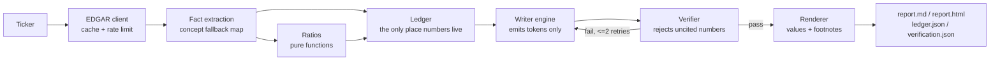

# Footnote

Footnote analyzes a public company from its SEC filings and writes an analysis where
every number carries a citation to the exact filing it came from.

**The guarantee: the language model never produces a number.** Every figure in a
Footnote report comes from a fact ledger that Python builds from SEC XBRL data. The
writer refers to facts by id using tokens like `{{F:revenue:FY2024}}` and
`{{R:gross_margin:FY2024}}`. A renderer replaces each token with the formatted value
and a footnote to the filing. A verifier then scans the text, and if it finds any
number that did not come from a token, the report is rejected and sent back for repair
(at most 2 retries, then it fails loudly). The deterministic code does the arithmetic;
the writer only chooses what to look at and explains it.

## Runs with no paid API key

The report writer is pluggable, and the default engine needs no API key at all:

| Engine | Cost | Notes |
|---|---|---|
| `template` (default) | free | A deterministic, rule-based writer. It selects facts and ratios and composes the report using only tokens for numbers, so it passes the identical verifier. |
| `ollama` | free | A real tool-use agent against a local Ollama model, used automatically if one is running. |
| `anthropic` | paid | The native tool-use loop, used only if `ANTHROPIC_API_KEY` is set. |

Everything else (the EDGAR client, fact extraction, ratios, ledger, render, verify,
tests, crosscheck, eval and the Streamlit app) is fully deterministic and needs no key.
Set `FOOTNOTE_ENGINE` or pass `--engine` to switch writers.

## How it works



Fact selection follows a few strict rules: annual flow items come only from 10-K and
10-K/A filings whose period spans 350 to 380 days; balance-sheet items are instant
facts matching a fiscal year-end; the fiscal year is derived from the period end date,
not the SEC `fy` field; and when several filings report the same period, the latest
filed one wins so restatements are captured. Missing metrics are recorded, never
estimated. See [docs/decisions.md](docs/decisions.md) for the ambiguous tag choices.

## Eval results

From [eval/eval.md](eval/eval.md) and [eval/results.md](eval/results.md), run over a
25-company universe spanning tech, banks, consumer staples, healthcare, energy and
retail:

- **25 of 25 reports pass verification, with 0 uncited numbers** (target 0).
- An independent crosscheck re-fetches every ledger fact through the SEC
  `companyconcept` endpoint (a different API surface). **Across all 25 companies: 0
  mismatched and 0 not-found.** A handful of KO facts have no `companyconcept` coverage
  to check against and are reported as such, never counted as a pass or a failure.

## Demo

Terminal, no writer involved:

```
$ footnote ledger AAPL --years 5

Apple Inc.  (AAPL)   CIK 320193
Industry: Electronic Computers (SIC 3571)
Fiscal years: FY2025, FY2024, FY2023, FY2022, FY2021

FACTS
                          FY2025    FY2024    FY2023    FY2022    FY2021
  Revenue                $416.2B   $391.0B   $383.3B   $394.3B   $365.8B
  Net income             $112.0B    $93.7B    $97.0B    $99.8B    $94.7B
  ...
RATIOS
  Gross margin             46.9%     46.2%     44.1%     43.3%     41.8%
  Free cash flow          $98.8B   $108.8B    $99.6B   $111.4B    $93.0B
  ...
```

Web app (report on the left, ledger on the right, click a footnote to highlight its
ledger row):

```
streamlit run app.py
```

The app opens in cached-demo mode, which loads committed reports for ten tickers so it
works with no API key and no live SEC calls.

## Install and run

```bash
uv venv
uv pip install -e '.[dev]'
export SEC_CONTACT_EMAIL="you@example.com"   # required by the SEC fair-access policy
```

```bash
footnote ledger AAPL --years 5               # raw deterministic ledger, no writer
footnote analyze AAPL --years 5 --out reports/
footnote compare AAPL MSFT GOOGL
streamlit run app.py                         # web app
```

Each `analyze` or `compare` run writes `report.md`, `report.html` (self-contained, with
clickable footnote links), `ledger.json` and `verification.json`. Every model call and
tool call is logged to `runs/<timestamp>.jsonl`.

Optional, to measure and re-verify:

```bash
python scripts/crosscheck.py                 # independent re-fetch of every fact
python scripts/eval.py                       # run the agent over 25 tickers
python scripts/build_fixtures.py             # refresh test fixtures from live SEC data
python scripts/build_demo.py                 # refresh the committed demo bundles
```

## Limitations

- US-GAAP 10-K filers only. No IFRS or 20-F foreign private issuers.
- Banks and insurers report no cost of revenue, so they get a reduced ratio set and
  the report says so.
- XBRL tagging varies by company. Footnote uses an ordered fallback map per concept and
  records which tag it used, but a metric a company tags in an unusual way may show up
  as missing rather than wrong.
- The fiscal year is derived from the period end date, so a company whose year ends in
  early January or February is labeled by that calendar year.
- Balance-sheet figures may be cited to a later 10-Q when that is the most recent filing
  to report the same period end.

## Tests

```bash
uv run pytest          # unit + fixture-based tests, no network
uv run ruff check .
```

Tests never touch the network; fact-selection tests run against trimmed real
companyfacts fixtures in `tests/fixtures/`.
